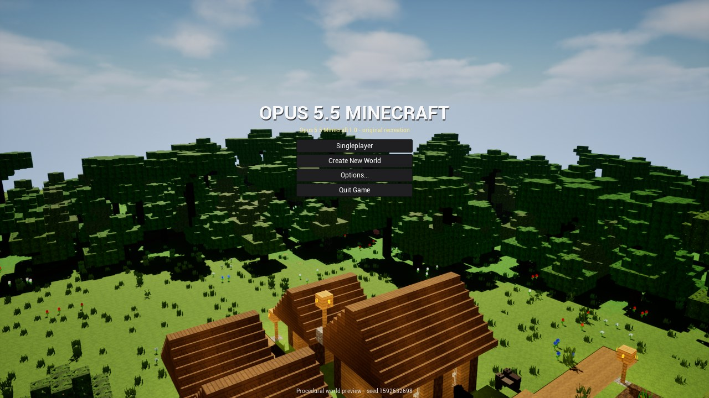

# Unreal Opus 5.5 Minecraft

Оригинальная однопользовательская voxel-игра на Unreal Engine 5.8, созданная Claude Opus 5.5 как часть сравнительного
YouTube-проекта. Здесь нет кода, текстур, звуков, шрифтов или логотипов Mojang: игровые материалы созданы специально
для этого проекта. Проект не связан с Mojang Studios или Microsoft.



## Самый простой запуск

Репозиторий содержит исходный проект, а не готовый многогигабайтный установщик. Один раз установите Unreal Engine и
компилятор; дальше запуск выполняется двойным кликом. В первый раз сборка C++ и шейдеров может занять продолжительное
время. Не закрывайте окно, пока Unreal показывает компиляцию шейдеров.

### Windows 10/11

1. Установите **Unreal Engine 5.8.x** через Epic Games Launcher.
2. Установите **Visual Studio 2022** с workload **Game development with C++** и Windows 11 SDK. Файл `.vsconfig` в этой
   папке позволяет Visual Studio предложить нужные компоненты автоматически.
3. На GitHub нажмите **Code -> Download ZIP**, распакуйте архив в короткий путь, например `C:\Games\OpusMinecraft`.
4. Откройте папку `Unreal Opus 5.5 Minecraft` и дважды щёлкните **`Launch-Windows.bat`**.
5. После открытия Unreal Editor нажмите зелёную кнопку **Play**. В игре выберите **Singleplayer -> Create New World**.

Скрипт сам находит Unreal Engine 5.8 и собирает недостающий C++ модуль. Если движок установлен нестандартно и не
обнаружен, создайте переменную среды `UE_5_8_ROOT`, указывающую на папку `UE_5.8`.

### macOS

1. Установите **Unreal Engine 5.8.x** через Epic Games Launcher.
2. Установите Xcode из App Store, один раз запустите его и примите лицензию. Версия Xcode должна поддерживаться вашей
   версией Unreal Engine 5.8.
3. Скачайте ZIP репозитория и распакуйте его.
4. В папке `Unreal Opus 5.5 Minecraft` дважды щёлкните **`Launch-macOS.command`**. При первом запуске macOS может
   попросить подтвердить открытие файла: нажмите правой кнопкой -> **Open**.
5. После открытия Unreal Editor нажмите **Play**, затем **Singleplayer -> Create New World**.

Если Finder сообщает, что файл нельзя выполнить, откройте Terminal в папке проекта и выполните:

```bash
chmod +x Launch-macOS.command
./Launch-macOS.command
```

Для нестандартного расположения движка можно задать `UE_5_8_ROOT=/путь/к/UE_5.8`. На macOS проект автоматически
отключает аппаратный ray tracing и использует Metal с программным Lumen.

## Управление

| Клавиша | Действие |
|---|---|
| W A S D | Движение |
| Мышь | Обзор |
| Space | Прыжок; двойное нажатие включает полёт в Creative |
| Left Shift / Left Ctrl | Красться / бежать |
| Левая / правая кнопка мыши | Ломать или атаковать / поставить или использовать |
| 1-9 или колесо мыши | Выбор слота |
| E | Инвентарь |
| Q / F | Выбросить предмет / поменять руки |
| T | Чат и команды |
| Esc | Пауза |
| F3 / F5 / F11 | Отладочная информация / камера / полный экран |

## Если что-то не запускается

- **`Unreal Engine 5.8 was not found`** — установите именно ветку 5.8.x либо задайте `UE_5_8_ROOT`.
- **Ошибка C++ build на Windows** — откройте Visual Studio Installer и добавьте **Game development with C++** и Windows
  SDK. Затем снова запустите `Launch-Windows.bat`.
- **Ошибка Xcode на macOS** — откройте Xcode, примите лицензию и выполните `xcode-select --install` в Terminal.
- **Долгий первый старт** — это нормально: Unreal компилирует проект, 657 процедурных слоёв текстур и шейдеры. Следующие
  запуски используют кэш и проходят быстрее.
- **Низкая производительность** — уменьшите Render Distance и Graphics Quality в меню Options.

## Что находится в папке

- `Source/` — C++ voxel engine и gameplay.
- `Content/` — карта, материалы и оригинальные `.uasset`-модели.
- `Config/` — настройки Unreal для Windows и macOS.
- `Docs/` — скриншоты и отчёты проверки.
- `Tools/` — воспроизводимые инструменты генерации контента.
- `UnrealMinecraft.blend` — исходная Blender-сцена моделей.
- `Unreal_Minecraft_Prompt` — полный исходный промпт, сохранённый без сокращений.
- `DEVELOPMENT.md` — архитектура, сборка, аргументы запуска и расширенная таблица управления.

Локальные сборки, кэши, сохранения, настройки IDE, ключи и файлы окружения исключены через `.gitignore`.
